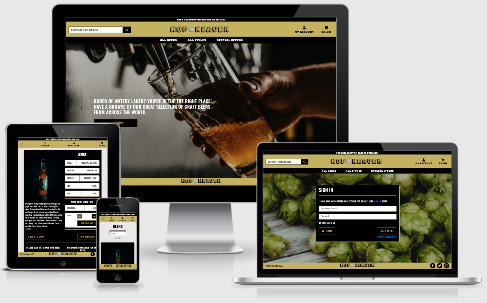

# Hop Heaven - Milestone Project 4

[View the live project here.]()

## Project Overview

## Project Goals

## User Stories (UX)

### Viewing and Navigation

* As a User I want to be able to Understand the purpose of the site to see if im interest in the product.
* As a User I want to be able to navigate easily through the site to have ease of use.
* As a User I want to be able to view beers available through the site to make a purchase.
* As a User I want to be able to view beer details through the site to see style, country, brewery, abv, bottle size.
* As a User I want to be able to identify any special offers through the site to purchase the offer.

### Registration & User Accounts

* As a User I want to be able to easily register a user account on the site to view my personal account.
* As a User I want to be able to easily login/logout through the site to make purchases more seamless.
* As a User I want to be able to recover my password to regain access to my account.
* As a User I want to be able to have a personalised user account so I can view my order history & update delivery information.

### Sorting & Searching

* As a User I want to be able to sort the list of available beers to view by price, name, style, country & abv.
* As a User I want to be sort by style of beer to find a specific beer from a certain style of beers.
* As a User I want to be search by beer name or description to focus my search on the beer im after.
* As a User I want to be able easily see what I've searched for and the number of results.

### Purchasing and Checkout

* As a User I want to easily select the quantity to add to my cart before making a purchase.
* As a User I want to view items in my cart to be purchased to identify the total cost.
* As a User I want to be update/delete the quantity of items in my cary to make changes before purchase.
* As a User I want to easily be able to enter payment/delivery information and save my details to make further purchases easier in the future.
* As a User I want to feel like my payment is secure so I'm confident when making a purchase.
* As a User I want to view my order confirmation once purchase has been made to make sure I have not made any mistakes.
* As a User I want to be able to receive an email confirmation on order to be sure I will receive my order & it is being delivered to the correct address.

### Admin & Store Management

* As the site owner I would like to be able to add a new beer so It's avaliable to purchase on the store.
* As the site owner I would like to be able to edit/update a beer to change product details.
* As the site owner I would like to be delete a beer if the item is no longer for sale.

## Design

### 1. Colour Scheme
* #C5B358 - Vegas Gold. Used in footer, header and mobile nav slider, box shadows, buttons and font that needs to stand out. This color has been used to give a premium feel to the products being purchased and allows back text to stand out.
#000000 - Black. Black has been used heavily across the site especially for the background color on bootstrap cards which allows the white text to be easily visible to read and fits the theme of the website.
#777777 - White. For the black backgrounds white has been used so the text is easily visible for the user.

### 2. Typography
* 'Bungee Shade' - Main Hop Heaven Logo. This font style has been used so the brand is distinct.
* 'Bungee' - Header/Navbar links. Fits in with the them for the main logo and is easily visible to the user.
* 'Oswald' - All remaining content. The text of Oswald has been used for all remaining content in uppercase as its easy on the eye/clear to read. Also fits in with the premium feel to the website.

### 3. Imagery
* Home Page Image - A craft beer being poured grabs the users attention and signals the purpose of the webiste.
* Accounts signup/signin/register/rating pages - A background of hops fits the theme of the website.
* Hops logo image - A hops image between the logo HOP HEAVEN gives a clear brand image.
* Product/Beer imagery - Photos for each beer which are clear to the user.

### 4. Icons

## WireFrames

Initial Wireframe designs made on Figma:

* [Initial - Home Page](static/readme-docs/wireframes/wireframe-home.jpg)
    * Finished design similar to initital wireframe. Hop Heroes & Why shop with us section left out due to time constraints.
* [Initial - Products Page](static/readme-docs/wireframes/wireframe-products.jpg)
* [Initial - Product Details Page](static/readme-docs/wireframes/wireframe-product-details.jpg)
    * Finished design similar to initital wireframe. Additional ratings section added to bottom of page for signed in user to rate the product.
* [Initial - Cart Page](static/readme-docs/wireframes/wireframe-product-details.jpg)
    * Finished Cart page slightly different design in a table style format.
* [Initial - Checkout Page](static/readme-docs/wireframes/wireframe-checkout.jpg)
    * Fnished page similar to initial design.
* [Initial - Checkout Success Page](static/readme-docs/wireframes/wireframe-checkout-success.jpg)
    * Fnished page similar to initial design.
* [Initial - Sign In Page](static/readme-docs/wireframes/wireframe-signin.jpg)
    * Fnished page similar to initial design.
* [Initial - Sign Out Page](static/readme-docs/wireframes/wireframe-signout.jpg)
    * Fnished page similar to initial design.
* [Initial - Sign Up Page](static/readme-docs/wireframes/wireframe-signup.jpg)
    * Fnished page similar to initial design.
* [Initial - Verify Page](static/readme-docs/wireframes/wireframe-verify.jpg)
    * Fnished page similar to initial design.
* [Initial - Profile Page](static/readme-docs/wireframes/wireframe-profile.jpg)
    * Fnished page similar to initial design. Additional ratings section added under order history
    to edit/delete your ratings.
* [Initial - Admin/management Page](static/readme-docs/wireframes/wireframe-admin.jpg)
    * Fnished page similar to initial design. 

* Other changes: Ratings Add/Edit pages not included in intitial designs. Feature added during development process. 

* All designs responsive for smaller devices.
    
## Features

### Site Wide

* Responsive on all devices.

* Search bar functionality within header to search by name/description.
* Navigation dropdown bar to select beers by style/view all in Header.
* Navigation dropdown bar to sort beers by rating, price & style all in Header.
* My account link in header to view profile, login, logout, signup.
* Cart link to view current shopping cart/checkout.
* Footer Social links.

### Home Page

### Products Page

* Ability to sort by price, name, rating & style.
* Navigation buttons at top for each style of beer when viewing all styles.
* Back to top button - fixed on medium/large displays and centred at bottom on smaller devices.
* img wapper for beer images for opaque zoom effect.

    
### Features left to implement

* 

### Languages Used

* 

### Frameworks, Libraries & Programs Used

## Testing

### User Stories Testing

### Functionality Testing - Products Page

#### Contact Form:

#### Social Media Icons:

### Responsive Design Testing:

### Lighthouse Performance Testing:

## Deployment

### GitHub Pages

### Making a Local Clone

## Credits

### Content

### Code

### Media 

### Acknowledgements
