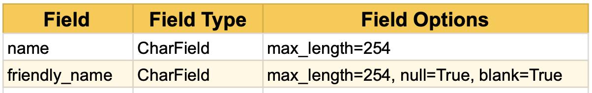
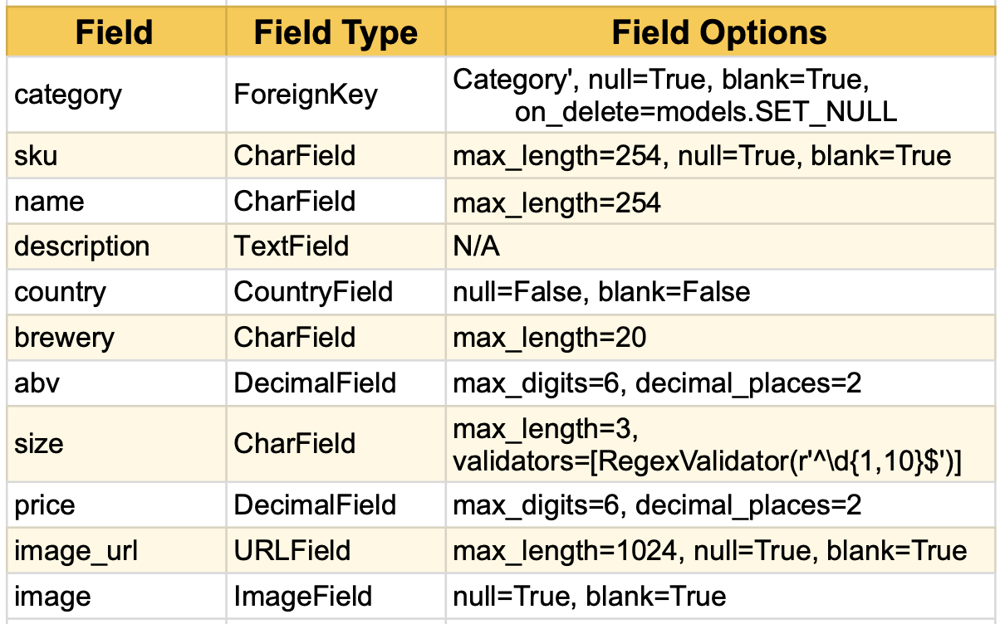
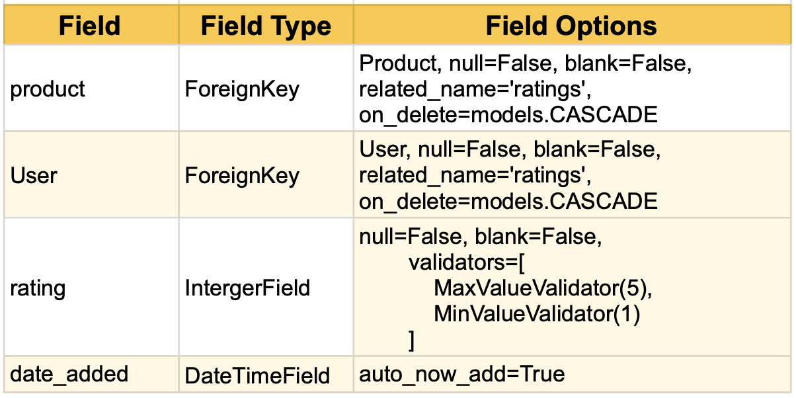
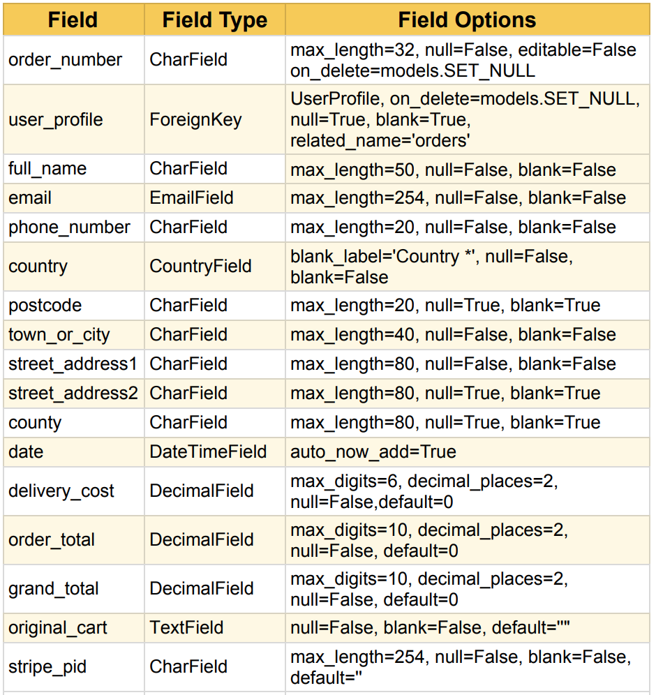
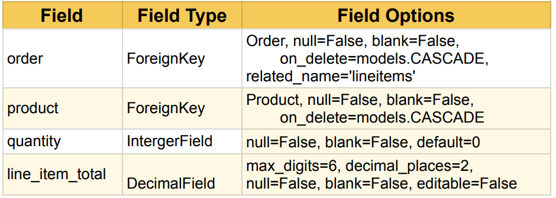
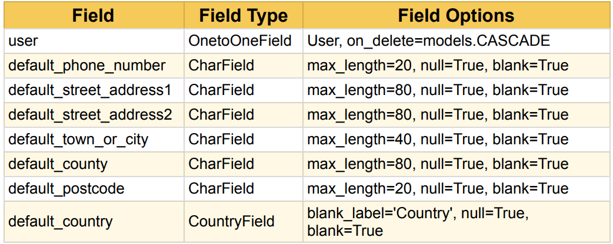

# Hop Heaven - Milestone Project 4

[View the live project here.](https://hop-heaven.herokuapp.com/)

## Project Overview

Hop Heaven is an e-commerce craft beer website which will allow craft beer enthusiasts to browse world leading craft beers, purchase craft beers and manage there account/leave ratings on beers.

## Project Goals 

* To design and develop and implement a full stack web application, with a relational database, using the Django/Python. This must have at least 2 custom models.
* Design and implement a relational data model, application features and business logic to manage, query and manipulate relational data to meet given needs in a particular real-world domain.
* Identify and apply authorisation, authentication and permission features in a full stack web application solution using django all-auth features.
* Integrate a cloud based payment system such as stripe to the project which could allow real world payments.
* Document the development process using a Git version control and deploy the application using heroku.
* Create a custom clean responsive front end design and implement to provide a distinct brand for the website to attract target users with an intuitive UI/UX.
* CRUD functionality must be included with feedback to user such as toast messages.
* Target Users for this site are craft beer enthusiasts.

## User Stories (UX)

### Viewing and Navigation

* As a User I want to be able to Understand the purpose of the site to see if im interest in the product.
* As a User I want to be able to navigate easily through the site to have ease of use.
* As a User I want to be able to view beers available through the site to make a purchase.
* As a User I want to be able to view beer details through the site to see style, country, brewery, abv, bottle size.
* As a User I want to be able to identify any special offers through the site to purchase the offer.

### Registration & User Accounts

* As a User I want to be able to easily register a user account on the site to view my personal account.
* As a User I want to be able to easily login/logout through the site to make purchases more seamless.
* As a User I want to be able to recover my password to regain access to my account.
* As a User I want to be able to have a personalised user account so I can view my order history & update delivery information.

### Sorting & Searching

* As a User I want to be able to sort the list of available beers to view by price, name, style, country & abv.
* As a User I want to be sort by style of beer to find a specific beer from a certain style of beers.
* As a User I want to be search by beer name or description to focus my search on the beer im after.
* As a User I want to be able easily see what I've searched for and the number of results.

### Purchasing and Checkout

* As a User I want to easily select the quantity to add to my cart before making a purchase.
* As a User I want to view items in my cart to be purchased to identify the total cost.
* As a User I want to be update/delete the quantity of items in my cary to make changes before purchase.
* As a User I want to easily be able to enter payment/delivery information and save my details to make further purchases easier in the future.
* As a User I want to feel like my payment is secure so I'm confident when making a purchase.
* As a User I want to view my order confirmation once purchase has been made to make sure I have not made any mistakes.
* As a User I want to be able to receive an email confirmation on order to be sure I will receive my order & it is being delivered to the correct address.

### Ratings

* As a User how do I rate a product that I have purchased?
* As a User I want to edit a rating I have previously added?
* As a User I want to delete a rating I have a previously added?
* As a user how do I view my ratings I have added to various products?
* As a user how do I get started with rating products?

### Admin & Store Management

* As the site owner I would like to be able to add a new beer so It's avaliable to purchase on the store.
* As the site owner I would like to be able to edit/update a beer to change product details.
* As the site owner I would like to be delete a beer if the item is no longer for sale.

## Design

### 1. Colour Scheme
* #C5B358 - Vegas Gold. Used in footer, header and mobile nav slider, box shadows, buttons and font that needs to stand out. This color has been used to give a premium feel to the products being purchased and allows back text to stand out.
#000000 - Black. Black has been used heavily across the site especially for the background color on bootstrap cards which allows the white text to be easily visible to read and fits the theme of the website.
#777777 - White. For the black backgrounds white has been used so the text is easily visible for the user.

### 2. Typography
* 'Bungee Shade' - Main Hop Heaven Logo. This font style has been used so the brand is distinct.
* 'Bungee' - Header/Navbar links. Fits in with the them for the main logo and is easily visible to the user.
* 'Oswald' - All remaining content. The text of Oswald has been used for all remaining content in uppercase as its easy on the eye/clear to read. Also fits in with the premium feel to the website.

### 3. Imagery
* Home Page Image - A craft beer being poured grabs the users attention and signals the purpose of the webiste.
* Accounts signup/signin/register/rating pages - A background of hops fits the theme of the website.
* Hops logo image - A hops image between the logo HOP HEAVEN gives a clear brand image.
* Product/Beer imagery - Photos for each beer which are clear to the user.

### 4. Icons
* Font Awesome Icons used for a clean UX.

## WireFrames

Initial Wireframe designs made on Figma:

* [Initial - Home Page](readme_docs/wireframes/wireframe-home.jpg)
    * Finished design similar to initital wireframe. Hop Heroes & Why shop with us section left out due to time constraints.
* [Initial - Products Page](readme_docs/wireframes/wireframe-products.jpg)
* [Initial - Product Details Page](readme_docs/wireframes/wireframe-product-details.jpg)
    * Finished design similar to initital wireframe. Additional ratings section added to bottom of page for signed in user to rate the product.
* [Initial - Cart Page](readme_docs/wireframes/wireframe-product-details.jpg)
    * Finished Cart page slightly different design in a table style format.
* [Initial - Checkout Page](readme_docs/wireframes/wireframe-checkout.jpg)
    * Fnished page similar to initial design.
* [Initial - Checkout Success Page](readme_docs/wireframes/wireframe-checkout-success.jpg)
    * Fnished page similar to initial design.
* [Initial - Sign In Page](readme_docs/wireframes/wireframe-signin.jpg)
    * Fnished page similar to initial design.
* [Initial - Sign Out Page](readme_docs/wireframes/wireframe-signout.jpg)
    * Fnished page similar to initial design.
* [Initial - Sign Up Page](readme_docs/wireframes/wireframe-signup.jpg)
    * Fnished page similar to initial design.
* [Initial - Verify Page](readme_docs/wireframes/wireframe-verify.jpg)
    * Fnished page similar to initial design.
* [Initial - Profile Page](readme_docs/wireframes/wireframe-profile.jpg)
    * Fnished page similar to initial design. Additional ratings section added under order history
    to edit/delete your ratings.
* [Initial - Admin/management Page](readme_docs/wireframes/wireframe-admin.jpg)
    * Fnished page similar to initial design. 

* Other changes: Ratings Add/Edit pages not included in intitial designs. Feature added during development process. 

* All designs responsive for smaller devices.
    
## Features/Quick Guide

### Site Wide

* Responsive on all devices.
* Toasts when performing certain actions to give the user feedback.
* Search bar functionality within header to search by name/description.
* Navigation dropdown bar to select beers by style/view all in Header.
* Navigation dropdown bar to sort beers by country, abv, price & style all in Header.
* JS Fade animation for dropdown menus on hover.
* My account link in header to view profile, login, logout, signup. Superuser can access beer management.
* Cart link in header to view current shopping cart/checkout.
* Footer Social links.

### index.html 

* Opening statement explaining the purpose of the website to the user with button to start shopping.

### products.html

* Ability to sort by price, name, style, country & abv.
* Navigation buttons at top for each style of beer when viewing each/all styles.
* Back to top button - fixed on medium/large displays and centred at bottom on smaller devices.
* img wapper for beer images with opaque zoom effect.
* Rating for each beer displayed which is dynamic based on average of user ratings.
* Country Flag for each beer displayed.

### product_detail.html

* Breakdown of beer info such as style, country, brewery, abv, bottle/can size, unit price and description.
* Make you selection section to with buttons to add a quantity to your cart.
* JS included to prevent multiple submits when adding to your cart.
* Nav buttons to back to shop or view cart.
* Ratings section at bottom of details page to view current ratings/leave a rating if signed in.
* Ratings within a carousel if ratings within database.
* Ratings carousel contained within product_ratings.html template.

### cart.html

* Breakdown of your current cart in easy to read table style format with the ability to update and remove items from your cart.
* Custom JS to give some feedback to the user when updating/removing items.
* Checkout and back to shop buttons.

### checkout.html

* Breakdown of your current order summary. If a large order - order will be scrollable. Adjust order. button next to order summary if order not quite right.
* Form to fill out with details, delivery and payment information using Stripe Payments.
* Ability to save your delivery information to your profile if you have an account.

### profile.html

* Save your default delivery information.
* View your order history and past order confirmations.
* View your current ratings and edit/delete these ratings. - Ratings within a carousel.
* Ratings carousel contained within profile_ratings.html template.
* If no ratings currently button to link to products page to leave your first rating.

### Ratings Edit/Add/Delete

* Leave your ratings between 1 & 5.
* Can only access these pages if signed in.
* Can only leave one rating per product.
* Can only edit rating if user rating matched session user.
* Form validation throws an error if inputing incorrect value.
* JS included to prevent multiple submits.
* When deleting a rating pop up modal is displayed to confirm whether you want to delete your rating.

### Beer Management (Add/Edit/Delete - Admin)

* Allows the superuser to add/edit/delete beers.
* Pop up modal on deleting product to confirm.

### Root template folder.

* Default All auth templates for django all-auth features.
* Custom Toasts to give feedback to the user with success/error/info & warning alerts.
* Custom 404 & 500 error pages.

### Defensive Design Features

* Use of form & model fields with data type validation across the site. Such as the rating model having max/min value validators so you can only leave a rating between 1 & 5.
* Within the ratings views.py user can only leave one rating per beer otherwise an error will be returned via a toast message.
* Within ratings views.py user has to match current session user otherwise they will not be authorized to edit/delete that rating. 
* On the front end via django templates on the product details page the edit/delete rating buttons will also only be displayed if the user matches the current session user.
* Login Required decorators used on views across multiple apps where the user is required to be signed in to access that feature.
* Ability to add/edit/delete products only if you are a superuser.

    
### Features left to implement

* Detailed about us page on why to to shop with hop heaven.
* Favourites app to star your favourites which will display these on your profile page to make for easier purchasing.
* Monthly subsciption with beer of the month delivered to your door.
* Contact app with form to fill out to contact the site owner.
* Blog app with monthly a blog post detailing interesting craft beer news from the site owner also mentioning any exciting deals/new beers in stock.
* Pagination.

## Database Schema

### Products App

* Category Model

* **Custom Products Model**

### Ratings App

* **Custom Ratings Model**

### Checkout App

* Order Model

* OrderLineItem Model

### Profiles App

* UserProfile Model

### Languages 

* [HTML5](https://en.wikipedia.org/wiki/HTML5)
* [CSS3](https://en.wikipedia.org/wiki/CSS)
* [Javascript](https://en.wikipedia.org/wiki/JavaScript)
* [Python3](https://en.wikipedia.org/wiki/Python_(programming_language))

### Frameworks, Libraries & Programs Used

* [Heroku](https://heroku.com/) - Platform that enables developers to build, run, and operate applications entirely in the cloud.
* [Jquery](https://en.wikipedia.org/wiki/JQuery)
* [Django](https://www.djangoproject.com/) - High-level Python web framework that encourages rapid development and clean, pragmatic design
* [SQlite](https://www.sqlite.org/index.html) - Default database
* [PostgreSQL](https://www.postgresql.org/) - Database used for deployed version.
* [Bootstrap4](https://getbootstrap.com/) - CSS Framework
* [Google Fonts](https://fonts.google.com/) - Google Fonts imported for my project.
* [AWS Amazon S3](https://aws.amazon.com/) - Used to host static/media files.
* [Font Awesome](https://fontawesome.com/) - Font Awesome was used to add icons for aesthetic and UX purposes.
* [Stripe](https://stripe.com/gb) - Used to make online payments/authentication.
* [Gitpod](https://www.gitpod.io/) - The Interactive Development Envvironment to code the website. Git was used for version control by utilizing the Gitpod terminal to commit to Git and Push to GitHub.
* [Github](https://github.com/) - GitHub is used to store the projects code after being pushed from Git.
* [Figma](https://figma.com/) - This was used to create my wireframe designs for desktop/mobile formats.
* [Chrome Dev Tools](https://developer.chrome.com/docs/devtools/) - To assist with debugging code and assessing perforamnce through lighthouse.
* [AmIResponsive](http://ami.responsivedesign.is/) - Used to created mock up of website.
* [FavIcon](https://favicon.io/) - Used to generate Favicon

## Testing

Testing in [test.md](/test.md) file

## Deployment

### GitHub Pages

### Making a Local Clone

## Credits

### Content

* [Website inspired from beerhawk](https://www.beerhawk.co.uk/)
* Beer info/descriptions from ratebeer.com/untappd.com

### Code

* Boutique Ado Mini project a helpful guide to this project.
* W3C schools/stack overflow.

### Media 

* [Logo png from pngwing.com](https://www.pngwing.com/en/free-png-scjji)
* All remaining images for site obtained from usplash.com.

### Acknowledgements

* Tutor support at code institute.
* My mentor Brian Macharia with his helpful feedback while developing this project.
