## Testing

* Chrome Development tools used during the development process to ensure the site is responsive/fixing any bugs.

* Website responsive from 350px up to large 2000px+ 4K displays. Viewed on various devices via chrome dev tools such as Mac, Mac Pro, Ipad, Ipad Mini, Iphone 5/6/7/8. 

### Validation

* [W3C Markup Validation - HTML](https://validator.w3.org/) - All HTML validated and any errors resolved.
* [W3C CSS Validation - CSS](https://jigsaw.w3.org/css-validator/) - CSS all validated - no errors.
* [PEP8 Validation - Python3](http://pep8online.com/) - All python code validated. A few errors have been left as this would inhibit code readibilty. These are the following:
    * Lines 72/73 of the webhook_handler.py
    * Line 11 of widgets.py
    * Line 36 of the forms.py within the profile app.
    * Line 26 of the forms.py within the ratings app.
* [Jshint Validation - JS](https://jshint.com/) - All JS validated - no errors.

### Functionality Testing

| Nr | Test          | Action | Before image  | After image  | Test result |
| ---|:-------------:| :----: | :-----:| :-----:| :-----:|
| 1 | Responsive on all devices  | Checked using Chrome DEV tools for varous devices for all pages across the entire site. | N/A | 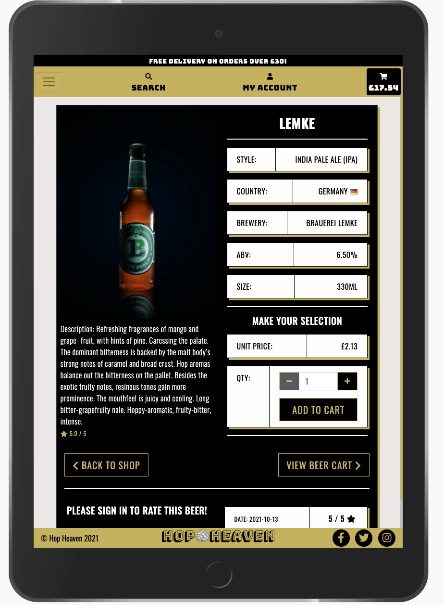 Example - Ipad | PASSED |
| 2 |  Check to see if all toasts are working | Checked entire site from checking out, to adding a product to the cart to registering a new account. | 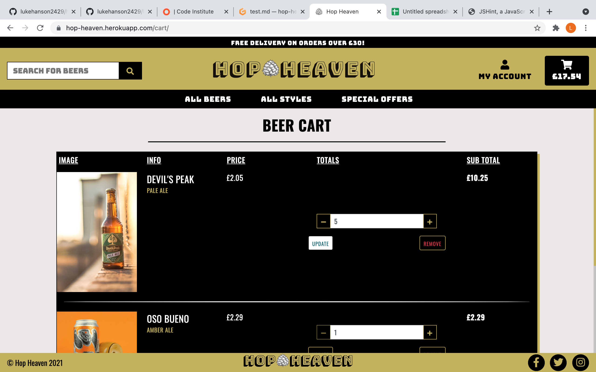 Toast Testing - cart example  |  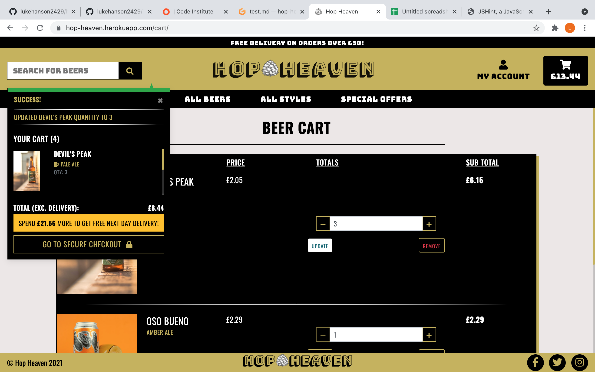 Toast Testing - cart example | PASSED |
| 3 |  All Navigation links working | Checked all navigation buttons/dropdown menus | 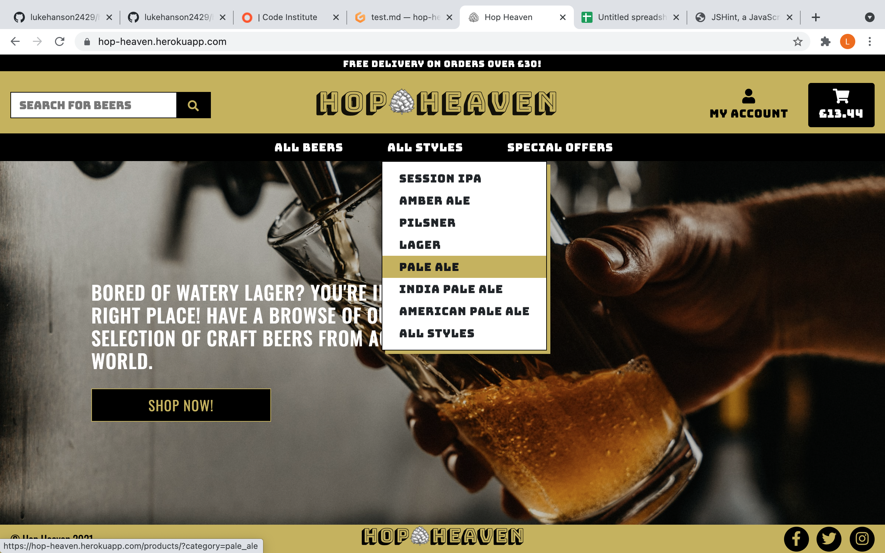 Nav Testing - dropdown example  |  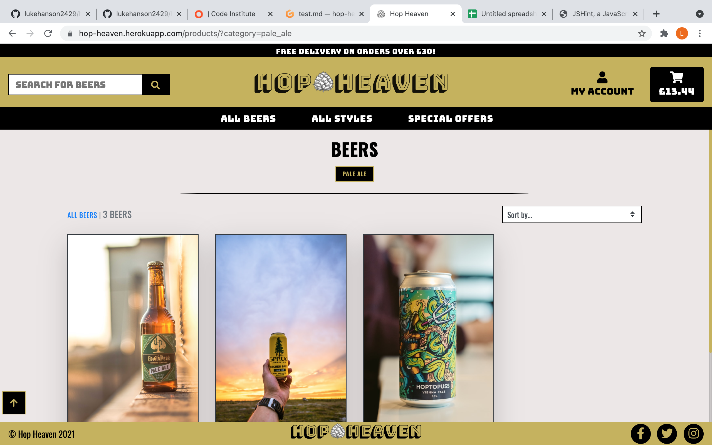 Nav Testing - dropdown example | PASSED |
| 4 |  Ability to sort products by price, name, style, country & abv. | Checked all sorting functionality. | 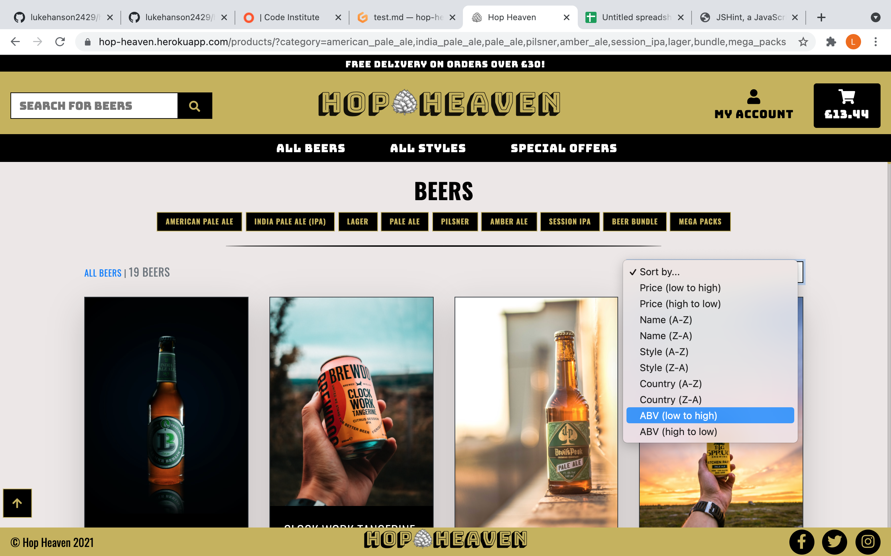 Sort Testing - abv example  |  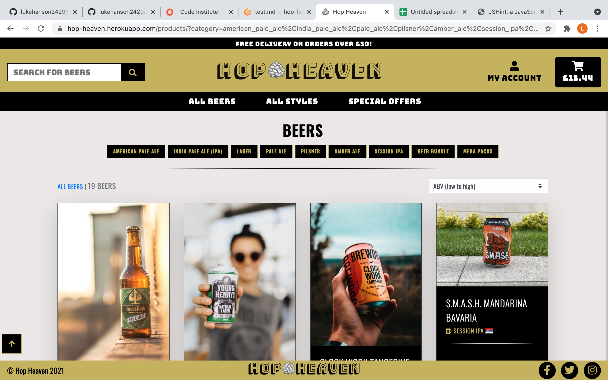 Sort Testing - abv example | PASSED |
| 5 |  Ability to search by name and description functionality | Searched within search bar. |  Searching - example  |  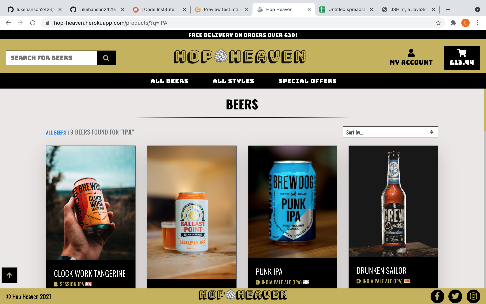 Searching - example | PASSED |
| 6 |  Form Validation testing to make sure form cannot be submitted unless correct data has been input in form fields. Tested across entire site. | Added incorrect input to rating field to check form validation is working. Toasts also being displayed as per Test Nr 2 to give user feedback. |  rating form validation - example  |  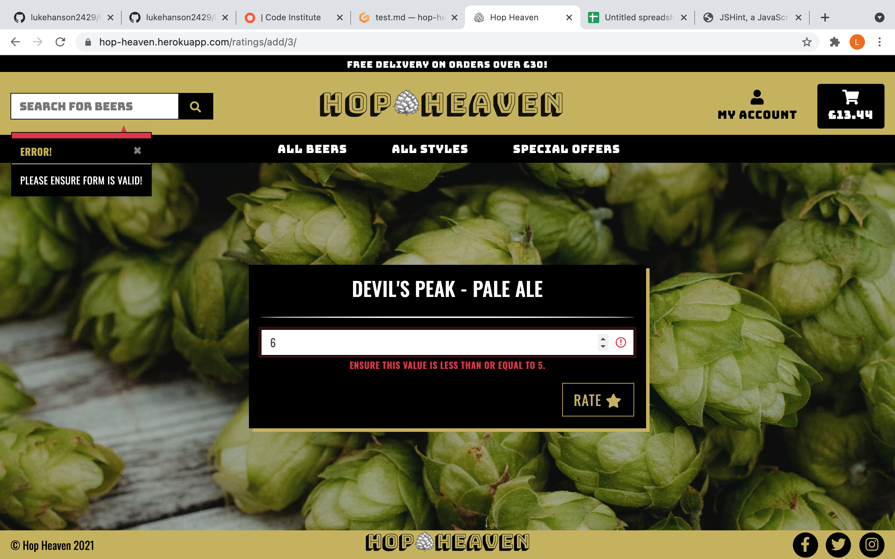 rating form - example | PASSED |
| 7 |  CRUD functionality - Adding | CRUD functionality to add a rating tested when user logged in. Superuser testing all completed to test adding a new product. |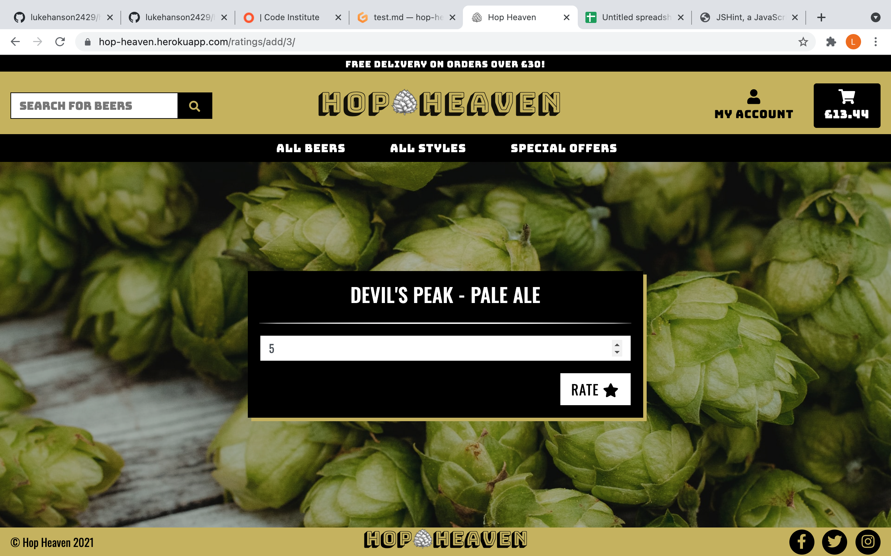 Add rating - example 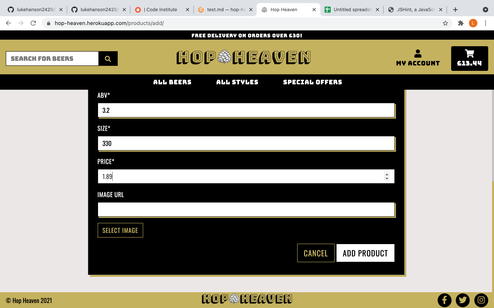 Add product - example |  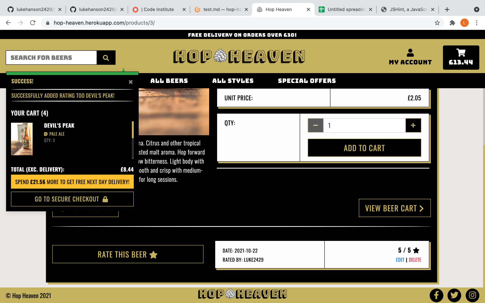 Add rating - example 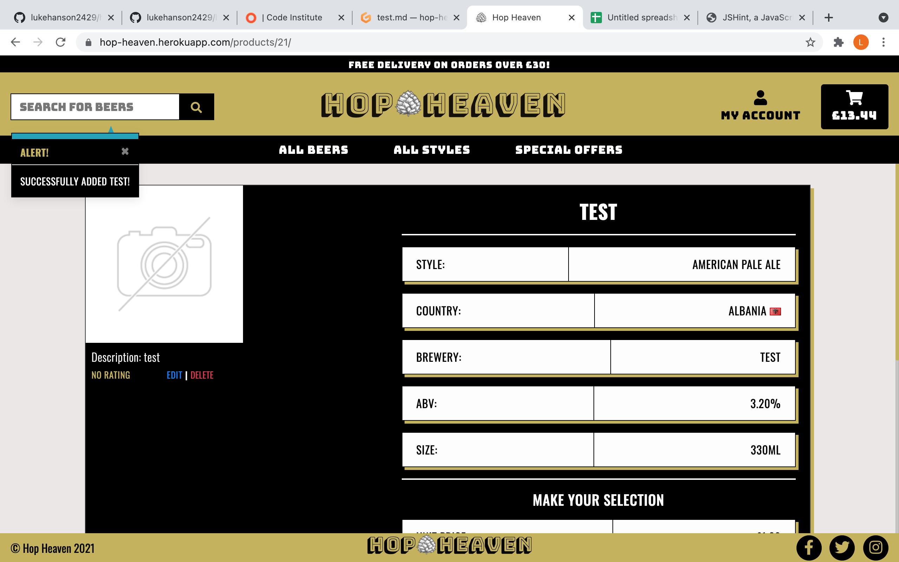 Add product - example | PASSED |
| 7 |  CRUD functionality - Updating | CRUD functionality to update a rating tested when user logged in via their profile. Superuser testing all completed to test updating a product. | Add rating - example  Add product - example |   Add rating - example  Add product - example | PASSED |