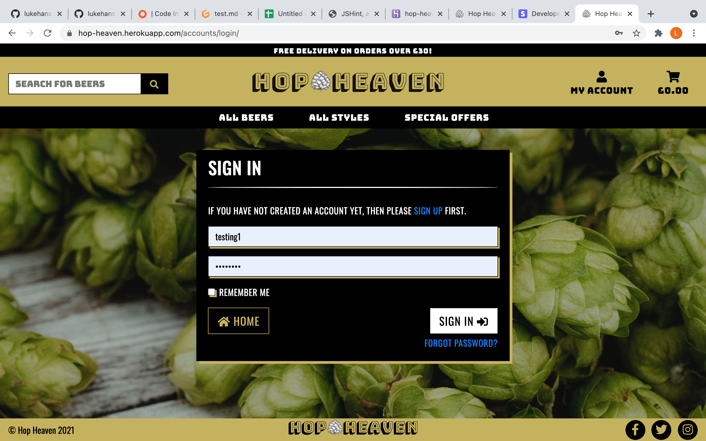

## Testing

* Chrome Development tools used during the development process to ensure the site is responsive/fixing any bugs.

* Website responsive from 350px up to large 2000px+ 4K displays. Viewed on various devices via chrome dev tools such as Mac, Mac Pro, Ipad, Ipad Mini, Iphone 5/6/7/8. 

* Tested on multiple browsers such as Safari, Google Chrome & Mozilla Firefox - All working.

### Validation

* [W3C Markup Validation - HTML](https://validator.w3.org/) - All HTML validated and any errors resolved.
* [W3C CSS Validation - CSS](https://jigsaw.w3.org/css-validator/) - CSS all validated - no errors.
* [PEP8 Validation - Python3](http://pep8online.com/) - All python code validated. A few errors have been left as this would inhibit code readibilty. These are the following:
    * Lines 72/73 of the webhook_handler.py
    * Line 11 of widgets.py
    * Line 36 of the forms.py within the profile app.
    * Line 26 of the forms.py within the ratings app.
* [Jshint Validation - JS](https://jshint.com/) - All JS validated - no errors.

### Functionality/UserStories Testing

| Nr | Test          | Action | Before image  | After image  | Test result |
| ---|:-------------:| :----: | :-----:| :-----:| :-----:|
| 1 | Responsive on all devices  | Checked using Chrome DEV tools for varous devices for all pages across the entire site. | N/A |  Example - Ipad | PASSED |
| 2 |  Check to see if all toasts are working | Checked entire site from checking out, to adding a product to the cart to registering a new account. |  Toast Testing - cart example  |   Toast Testing - cart example | PASSED |
| 3 |  All Navigation links working | Checked all navigation buttons/dropdown menus |  Nav Testing - dropdown example  |   Nav Testing - dropdown example | PASSED |
| 4 |  Ability to sort products by price, name, style, country & abv. | Checked all sorting functionality. |  Sort Testing - abv example  |   Sort Testing - abv example | PASSED |
| 5 |  Ability to search by name and description functionality | Searched within search bar. |  Searching - example  |   Searching - example | PASSED |
| 6 |  Form Validation testing to make sure form cannot be submitted unless correct data has been input in form fields. Tested across entire site. | Added incorrect input to rating field to check form validation is working. Toasts also being displayed as per Test Nr 2 to give user feedback. |  rating form validation - example  |   rating form - example | PASSED |
| 7 |  CRUD functionality - Adding | CRUD functionality to add a rating tested when user logged in. Superuser testing all completed to test adding a new product. | Add rating - example  Add product - example |   Add rating - example  Add product - example | PASSED |
| 8 |  CRUD functionality - Updating | CRUD functionality to update a rating tested when user logged in via their profile. Superuser testing all completed to test updating a product. Update Cart - User Stories Testing | Update rating - example  Update product - example  Update cart - example |   Update rating - example  Update product - example  Update cart - example | PASSED |
| 9 |  CRUD functionality - Deleting | CRUD functionality to delete a rating tested when user logged in via their profile. Superuser testing all completed to test delete a product. Deleting Cart - User Stories. | Delete rating - example  Delete product - example  Delete Cart - example |   Delete rating - example  Delete product - example  Delete Cart - example | PASSED |
| 10 |  Stripe Payments | Stripe Payments Tested throughout the development process and webhook url configured to live deployed version | N/A |  Stripe Payment Intent created/Succeeded  - 200 response | PASSED |
| 11 |  Creating a user account | Registering a new account account - User Stories |  Registering an account |  Registering an account | PASSED |
| 12 |  Login Testing | Logging into existing user account |  Login |  Login | PASSED |
| 13 |  Logout Testing | Logout account - User Stories |  Logout|  Logout | PASSED |
| 14 |  Password Reset Testing | Recover my password to regain access to my account. - User Stories |  Input email adress to resent password |  Email sent to reset password | PASSED |
| 15 |  Order History Testing | View existing order history via profile - User Stories |  View order history on profile |  Existing Order Confirmation | PASSED |
| 16 |  Profile Delivery Information Testing | Update existing delivery information to make checking out easier - User Stories |  Saving delivery info on Profile |  Displayed when checking out | PASSED |
| 17 |  404 error page Testing | incorrect url  | ...  | 404 Page Displayed | PASSED |

#### Additional Testing Notes

* All user stories checked and satisfied.
* Order confirmation email received when checking out.
* JS working to prevent multiple submits when adding a rating/adding a beer to your cart.
* To checkout stripe test payment must be used using 4242 4242 4242 4242 04/24 242 42424
* Static/Media files hosted correctly on AWS S3 Bucket.
    * Checked also by adding new product via admin with new image. Image updated automatically to media folder within S3 Bucket.

### Lighthouse Testing

* Lighthouse testing undertaken using chrome dev tools - exceptional performance on desktop devices.
* Lighthouse testing undertaken using chrome dev tools - within acceptable constraints for mobile devices.
    * Could be improved upon further with optimization.

### Bugs/Development Fixes

* Ability to enter add multiple ratings for each beer. Resolved by using an objects filter:
```
# filter product ratings by user
user_rating = Rating.objects.filter(product=product, user=user)

    # If there is a rating from current user raise an error
    if user_rating:
        # error raised
        messages.error(request, 'You have already rated this beer!')
        return redirect(reverse('product_detail', args=[product.id]))
```

* Website incorrectly responsive for XL devices such as Mac Pro. Fixed by setting max width of 2000px with ml & mr auto on body,html, header & footers.:
```
body,
html {
    height: 100%;
    overflow-x: hidden;
    max-width: 2000px; 
    margin-left: auto;
    margin-right: auto;
}


```